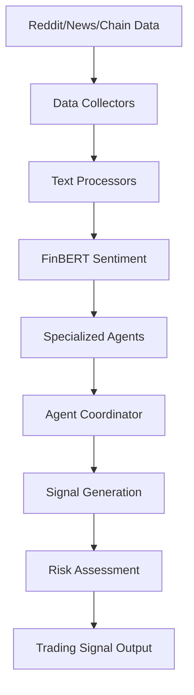

# 🏗️ System Architecture

## Overview

The Multi-Agent Crypto Market Sentiment Analyzer is a production-ready system that combines:
- **Multi-Agent Architecture**: 6 specialized AI agents orchestrated via LangChain
- **Real-Time Data Collection**: Reddit, News, On-Chain data
- **NLP Analysis**: FinBERT for financial sentiment analysis
- **Signal Generation**: Smart divergence-based trading signals

## Architecture Diagram

```
┌─────────────────────────────────────────────────────────────────┐
│                      PRESENTATION LAYER                          │
│  ┌─────────────────┐  ┌──────────────────┐  ┌───────────────┐   │
│  │   Streamlit     │  │   FastAPI REST   │  │  WebSocket    │   │
│  │   Dashboard     │  │      API         │  │   Streaming   │   │
│  └────────┬────────┘  └────────┬─────────┘  └───────┬───────┘   │
└───────────┼────────────────────┼────────────────────┼───────────┘
            │                    │                    │
            └────────────────────┴────────────────────┘
                                 │
┌────────────────────────────────▼────────────────────────────────┐
│                    AGENT COORDINATION LAYER                      │
│                                                                  │
│  ┌──────────────────────────────────────────────────────────┐   │
│  │              LangChain Agent Coordinator                   │   │
│  │         (Groq LLM - llama-3.1-70b-versatile)              │   │
│  └──────────────────────────────────────────────────────────┘   │
│                                                                  │
│  ┌─────────┐ ┌─────────┐ ┌─────────┐ ┌─────────┐ ┌─────────┐   │
│  │ Social  │ │  News   │ │ Chain   │ │ Whale   │ │ Signal  │   │
│  │ Agent   │ │  Agent  │ │ Agent   │ │ Agent   │ │ Agent   │   │
│  └────┬────┘ └────┬────┘ └────┬────┘ └────┬────┘ └────┬────┘   │
│       │           │           │           │           │          │
│  ┌────▼────┐ ┌────▼────┐ ┌────▼────┐ ┌────▼────┐ ┌────▼────┐   │
│  │  Risk   │                                                     │
│  │  Agent  │                                                     │
│  └─────────┘                                                     │
└─────────────────────────────────────────────────────────────────┘
                                 │
┌────────────────────────────────▼────────────────────────────────┐
│                       ML/NLP LAYER                               │
│                                                                  │
│  ┌─────────────────────┐  ┌─────────────────────────────────┐   │
│  │  FinBERT Sentiment  │  │     Signal Generation Model     │   │
│  │  (ProsusAI/finbert) │  │   (Divergence-based Strategy)   │   │
│  └─────────────────────┘  └─────────────────────────────────┘   │
└─────────────────────────────────────────────────────────────────┘
                                 │
┌────────────────────────────────▼────────────────────────────────┐
│                    DATA COLLECTION LAYER                         │
│                                                                  │
│  ┌─────────────┐  ┌─────────────┐  ┌─────────────────────────┐  │
│  │   Reddit    │  │    News     │  │     On-Chain            │  │
│  │  Collector  │  │  Collector  │  │     Collector           │  │
│  │   (PRAW)    │  │  (NewsAPI)  │  │  (CCXT/Blockchain.com)  │  │
│  └─────────────┘  └─────────────┘  └─────────────────────────┘  │
└─────────────────────────────────────────────────────────────────┘
                                 │
┌────────────────────────────────▼────────────────────────────────┐
│                      STORAGE LAYER                               │
│                                                                  │
│  ┌─────────────┐  ┌─────────────┐  ┌─────────────────────────┐  │
│  │   FAISS     │  │    Redis    │  │      PostgreSQL         │  │
│  │ VectorStore │  │    Cache    │  │    (Signal History)     │  │
│  └─────────────┘  └─────────────┘  └─────────────────────────┘  │
└─────────────────────────────────────────────────────────────────┘
```

## Component Descriptions

### 1. Agents

| Agent | Purpose | Data Source |
|-------|---------|-------------|
| Social Agent | Reddit sentiment analysis | PRAW (Reddit API) |
| News Agent | News sentiment analysis | NewsAPI |
| Chain Agent | On-chain metrics | CCXT, Blockchain.com |
| Whale Agent | Large transaction tracking | Blockchain.com |
| Signal Agent | Signal generation | All agent outputs |
| Risk Agent | Risk assessment | Market data, volatility |

### 2. Signal Generation Logic

```
1. Parallel Data Collection from all agents
2. Divergence Detection:
   - Whale accumulation + Retail fear → BULLISH
   - Whale distribution + Retail greed → BEARISH
3. LLM Synthesis via Groq API
4. Risk-adjusted confidence scoring
```

### 3. Data Flow



## Technology Stack

| Component | Technology |
|-----------|------------|
| Language | Python 3.10+ |
| ML/NLP | PyTorch, Transformers, FinBERT |
| Agents | LangChain, LangGraph |
| LLM | Groq API (Mixtral-8x7b) |
| APIs | PRAW, NewsAPI, CCXT |
| Backend | FastAPI, WebSocket |
| Frontend | Streamlit, Plotly |
| Storage | FAISS, Redis, PostgreSQL |
| Deployment | Docker, Docker Compose |
